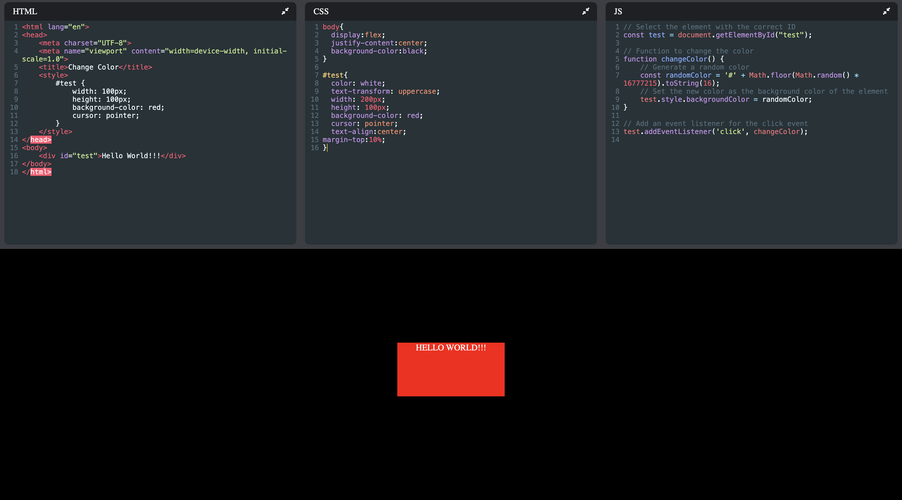

# Codepen Clone
This project is a CodePen clone built with React and Vite, offering live code editing capabilities for HTML, CSS, and JavaScript. It allows users to create, edit, and preview code snippets in real time.

Features
Live Preview: See real-time updates of your code changes in HTML, CSS, and JavaScript.
Local Storage: Code persists across page refreshes using local storage.
Editor: Integrated editors for HTML, CSS, and JavaScript using CodeMirror.
Resizable Panels: Collapse and expand editor panels for a customizable workspace.
Code Autocompletion: Enhanced coding experience with autocompletion.

## Installation

Install codepen-clone with npm

```bash
  https://github.com/vaanskii/codepen-clone
  cd codepen-clone
  npm install
```

Run server:
```bash
  npm run dev
```
## Screenshots


